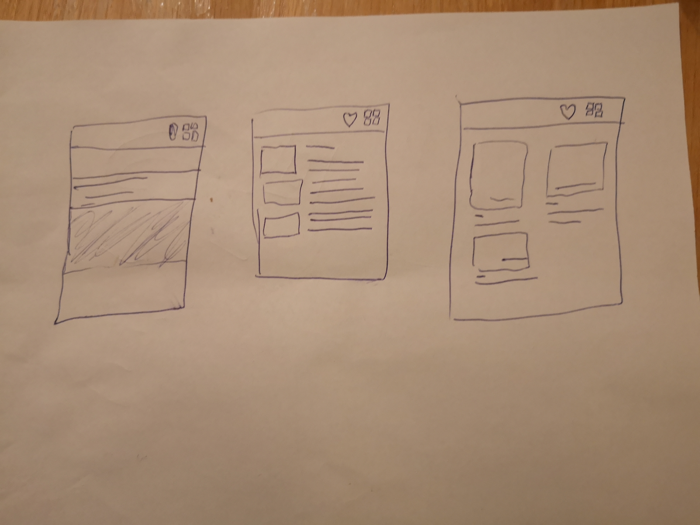

# cantera

A small app I am making for a technical challenge from FINN.no.

## Structure

The app consists of one view controller [AdsCollectionViewController](cantera/Controller/AdsCollectionViewController.swift). 
The controllers main content view is a collection view that uses the [AdViewCollectionViewCell](cantera/View/AdViewCollectionViewCell.swift).
The other views are [LoadingIndicatorView](cantera/View/LoadingIndicatorView.swift), [EmptyCollectionView](cantera/View/EmptyCollectionView.swift) and [FavoriteButton](cantera/View/FavoriteButton.swift). The networking requests are managed by the [RequestHandler](cantera/Handlers/RequestHandler.swift).
For persistence the [StorageHandler](cantera/Handlers/StorageHandler.swift) is used.

The group structure is summarised below with clickable links for your
convenience ;)

- [Handlers](cantera/Handlers) - persistence and networking
- [Extensions](cantera/Extensions/) - extensions for convenience
- [Controller](cantera/Controller) - view controller used in the app
- [View](cantera/View/) - all the views
- [Model](cantera/Model/) - API and UI model

## Demo

## Potential improvements

### Animations

It would have been awesome if I had gotten around to making some animations.
Like f. ex.  user toggles the favourite button.

### Use ad-type

It would have been cool to show different views based on the `ad-type`, maybe
icons like FINN does?

### Misc topics

- Proper error strategy (be responsive and avoid eternal spinning wheel or empty screens)
- Performance tuning using instruments
- Cleanup strategy for persisted file

### One more thing

The feature I wanted to add was a collection of predefined layouts the user
could switch between. So for ex. you would press a `UIBarButtonItem`  and it
would change the layout from grid to table view. I mainly wanted to support
three layouts, the table view type one, regular collection view grid and a nice
full screen one. Below is a drawing of it:

