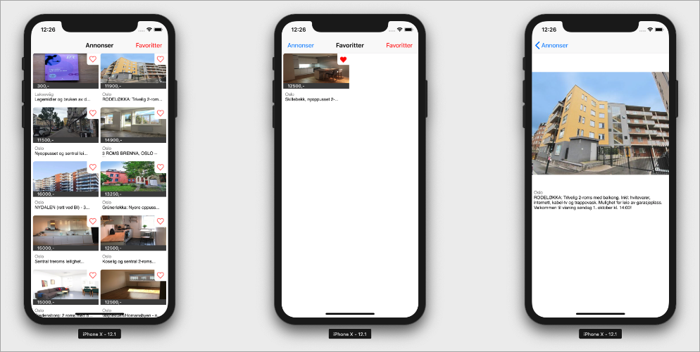

# cantera

A small app I am making for a technical challenge from FINN.no.

## Structure

In the top level directory of `cantera` there is the usual Xcode files.  I have
tried to structure everything in small groups, explained below with clickable
links for your convenience ;)

- [Storage](cantera/Storage) - wrapper to read / write JSON from / to application sandbox
- [Networking](cantera/Networking/) - contains URLSession wrapper functions to fetch the JSON payload, download images, endpoints, and image cache handling.
- [Extensions](cantera/Extensions/) - extensions to UIColor and String for convenience
- [Controller](cantera/Controller) - the view controllers used in the app
- [View](cantera/View/) - contains the collection view cell for the ads controller
- [Model](cantera/Model/) - split into API response model and UI model

TODO: add a proper description

TODO: higlight interesting bits in the code

## Potential improvements

There is some copy / pasta in between the view controllers. Would have been
nice to plan out better and create separate view component classes that could
be reused across them f. ex. the favourite button.

Error states are not being handled at all. They should be addressed gracefully
with sane default behaviour. I feel like the ads view controller could have
been done much better, getting it to support dynamic attributed text was harder
than I thought it would be using Auto Layout.

## If I had more time what would I want to do

It would have been awesome if I had gotten around to making some animations. At
least one for when you selected the heart item and the other transitions
between view controllers.

I tried hard to avoid adding any third party dependency, maybe that was a
mistake?  I could have speed up things by pulling in something like
[FinniversKit][f] for the UI.

One more thing. The feature I wanted to add was a collection of predefined
layouts the user could switch between. So for ex. you would press a
`UIBarButtonItem`  and it would change the layout from grid to table view. I
mainly wanted to support three layouts, the table view type one, regular
collection view grid and a nice full screen one.

Note: I have only run the code on simulators, so there might be some surprises
in the real world.

[f]: https://github.com/finn-no/FinniversKit
